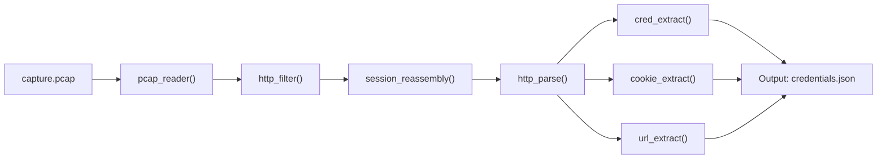

# SniffDog

Packet capture analyzer. Feed it a pcap, get back credentials, cookies, URLs, and HTTP streams. Pipeline-based processing — generators all the way down.

> Built after a weekend of staring at Wireshark output on a pentest. Needed something that just spat out the creds without clicking through 2,000 packets.

## Data Flow



Every stage is a generator. The pipeline is lazy — nothing is parsed until you iterate. Good for 4GB pcaps on a laptop with 8GB RAM. Bad for your swap if you materialize the whole thing.

## Usage

```
python sniffdog.py -r capture.pcap -o results.txt
python sniffdog.py -r capture.pcap --json
python sniffdog.py -r capture.pcap --quiet  # just show creds
```

### Arguments

| Flag | Description |
|------|-------------|
| `-r` | Pcap file to read (required) |
| `-o` | Output file (optional, stdout if omitted) |
| `--json` | JSON output format |
| `--quiet` | Only print credentials and cookies found |
| `--no-sessions` | Skip session reassembly (faster) |

## Pipeline Reference

### `pcap_reader(path)`
Yields `(packet, raw_bytes)` tuples from a pcap file. Uses scapy's `rdpcap()` in streaming mode — but tbh scapy loads the whole thing anyway if it's a pcap (not pcapng). FIXME in sniffdog.py line 34.

### `http_filter(stream)`
Generator. Takes raw packets, yields only those with TCP port 80 or 443 (or any port with HTTP-looking payloads). Drops everything else.

### `session_reassembly(packets)`
Groups packets by TCP tuple (src_ip, src_port, dst_ip, dst_port). Yields ordered byte streams per session. This is where the magic (and bugs) live.

### `http_parse(sessions)**
Yields parsed HTTP objects: method, path, headers, body. Skips malformed junk silently.

### `cred_extract(http_objects)`
Looks for:
- `Authorization: Basic <base64>` → decodes to user:pass
- `POST` bodies with `username`/`password`/`passwd`/`login` fields
- `user` and `pass` URL params
- NTLM auth challenges (raw hex, needs decoding separately)

### `cookie_extract(http_objects)`
Pulls `Cookie` and `Set-Cookie` headers. Session cookies flagged.

### `url_extract(http_objects)`
Dumps all requested URLs with methods. Deduplicated.

## TODO

- [x] Basic Auth extraction
- [ ] HTTPS decryption (mitmproxy integration — separate project)
- [ ] Better pcapng support (scapy's reader is flaky with nanosecond timestamps)
- [ ] DNSSEC parsing (low value, high effort)
- [ ] Export to HAR format
- [ ] FTP stream extraction (need to handle multi-port passive)

## Known Issues

- Session reassembly drops packets when TCP sequence numbers wrap. Rare on modern networks but it happens.
- Scapy's `TCP` layer parsing is slow on huge captures. Use `--no-sessions` for quick scans.
- POST body extraction misses URL-encoded forms split across multiple packets. FIXME in reassembly.

## License

MIT. Don't use on networks you don't own.
